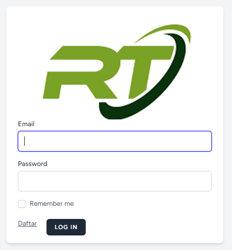

# 🚀 Aplikasi Rukun Tetangga untuk administrasi dan keuangan

> Aplikasi ini dibangun dengan **Laravel 12**, berjalan di atas **PHP 8.2** dan **Nginx**, dikembangkan oleh **MRP DevOps**.

---

## 📸 Screenshots

### Dashboard


### Login Page



## 📌 Tech Stack
- ⚡ **Laravel 12** – Backend Framework
- 🐘 **PHP 8.2** – Runtime
- 🌐 **Nginx** – Web Server
- 🗄 **PostgreSQL / MySQL** – Database (sesuaikan kebutuhan)
- 🔒 **Auth Middleware** – Custom Authentication

---
## ⚙️ Installation
### 1. Clone Repository
```
git clone https://github.com/skywall212/rt-app
cd rt-app
```
### 2. Install Dependencies
```
composer install
npm install && npm run dev
```
### 3. Setup Environment
```
cp .env.example .env
php artisan key:generate
```
### 4. Database Migration
```
php artisan migrate --seed
```
### 5. Run Development Server
```
php artisan serve
```
### 6. Config NGINX 
```

server {
    listen 80;
    server_name opr.local;

    root /home/website/rt-app/public;

    index index.php index.html;

    location / {
        try_files $uri $uri/ /index.php?$query_string;
    }

    location ~ \.php$ {
        include snippets/fastcgi-php.conf;
        fastcgi_pass unix:/var/run/php/php8.2-fpm.sock;
        fastcgi_param SCRIPT_FILENAME $document_root$fastcgi_script_name;
        include fastcgi_params;
    }

    client_max_body_size 100M;
}
```
## 📂 Project Structure
```
rt-app/
├── app/ # Core application (Controllers, Models, etc.)
├── bootstrap/
├── config/ # Configuration files
├── database/ # Migrations & Seeders
├── public/ # Public assets (index.php, etc.)
├── resources/ # Views (Blade), JS, CSS
├── routes/ # Web & API Routes
└── tests/ # Unit & Feature tests
```

## 📖 Features

✅ User Authentication & Authorization

✅ CRUD Master Data

✅ API Ready

✅ Optimized for Nginx + PHP-FPM

✅ Scalable & Secure

## 👨‍💻 Author

MRP DevOps

### 🛠 Passionate about building reliable, secure, and scalable systems.

---

## ☕ Support Project

Jika project ini bermanfaat dan membantu pekerjaan Anda,  
Anda bisa memberikan dukungan melalui Saweria:

<p align="center">
  <a href="https://saweria.co/mrpstudio" target="_blank">
    
  </a>
</p>

Setiap dukungan Anda sangat berarti untuk pengembangan project ini.  
Terima kasih 🙏

---
